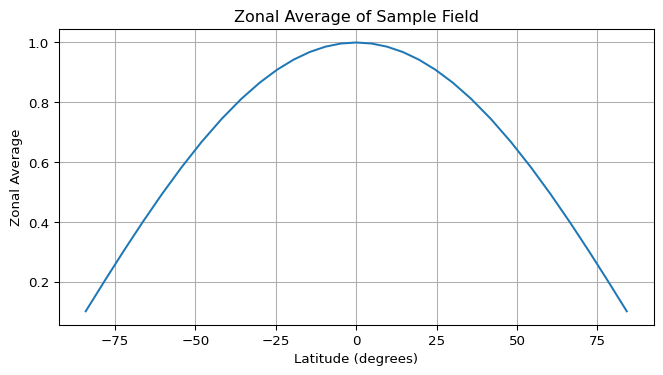
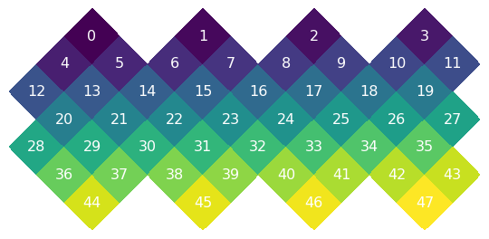
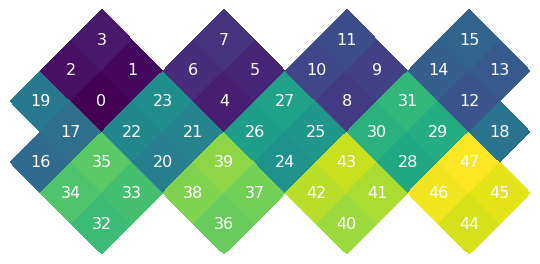
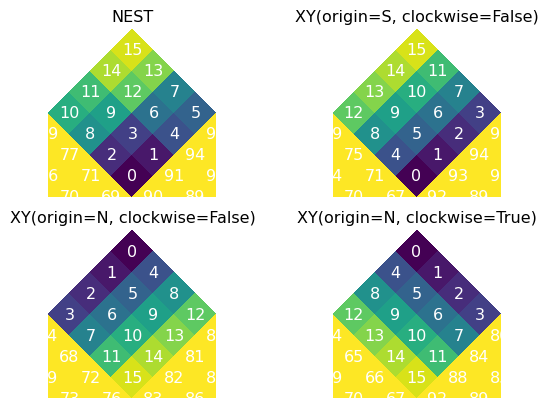
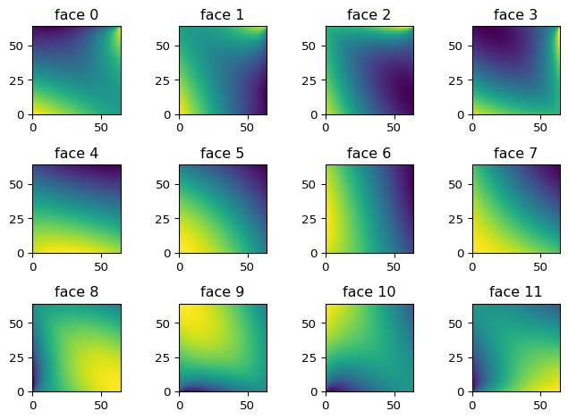

# HEALPix Tutorial


<!-- SPDX-FileCopyrightText: Copyright (c) 2024 NVIDIA CORPORATION & AFFILIATES. All rights reserved.
SPDX-License-Identifier: Apache-2.0
&#10;Licensed under the Apache License, Version 2.0 (the "License");
you may not use this file except in compliance with the License.
You may obtain a copy of the License at
&#10;http://www.apache.org/licenses/LICENSE-2.0
&#10;Unless required by applicable law or agreed to in writing, software
distributed under the License is distributed on an "AS IS" BASIS,
WITHOUT WARRANTIES OR CONDITIONS OF ANY KIND, either express or implied.
See the License for the specific language governing permissions and
limitations under the License. -->

# Introduction

This tutorial demonstrates key HealPIX functionality including:

1.  Visualization using double pixelization
2.  Zonal averaging
3.  Regridding between different grids
4.  Reordering between different pixel ordering schemes
5.  Padding for machine learning applications

## Installation

Earth2grid has some compiled components (in CUDA and C). So some care is
required to install. First, install pytorch, and setuptools

    # python3 -m venv .venv # make venv
    # source .venv/bin/activate # activate venv
    pip install torch setuptools
    pip install --no-build-isolation https://github.com/NVlabs/earth2grid/archive/6a1fd7ef271b52ac240338efd5c2027cca317997.tar.gz

> [!WARNING]
>
> It is very important to use the `--no-build-isolation` flag.
> Otherwise, the library may be built against a different version of
> pytorch than you have installed, this will cause strange “missing
> symbols” errors.

## Setup

First, let’s import the necessary libraries and create a sample HealPIX
grid.

``` python
import matplotlib.pyplot as plt
import numpy as np
import torch

import earth2grid
from earth2grid import healpix

# Create a sample HealPIX grid
level = 3  # Resolution level (higher = finer resolution)
grid = healpix.Grid(level=level, pixel_order=healpix.PixelOrder.RING)
print(grid.lat[:5])
```

    [84.14973294 84.14973294 84.14973294 84.14973294 78.28414761]

<details class="code-fold">
<summary>Code</summary>

``` python
SHOW_AXES = False

def pcolor_hpx(z):
    z = torch.as_tensor(z)
    npix = z.shape[0]
    i_ring = torch.arange(npix)
    nside = healpix.npix2nside(npix)
    grid = healpix.Grid(healpix.npix2level(npix))
    y, x =healpix.ring2double(nside, i_ring)

    # plt.imshow(healpix.to_double_pixelization(z, fill_value=float('nan')))

    # rotate clockwise by 45 degrees
    x, y = (x + y) // 2, (x - y) // 2

    y -= y.min()
    x -= x.min()


    out = torch.full((x.max() + 1, y.max() + 1), torch.nan)
    out[x, y] = z.float()

    x, y = (x+y) /2, (x-y) / 2
    xx, yy = torch.meshgrid(torch.arange(out.shape[0] + 1), torch.arange(out.shape[1] + 1))
    # im = plt.pcolor(x, y, out)
    im = plt.pcolormesh((xx+yy) / 2, -(xx-yy) / 2, out)
    plt.ylim(-nside,nside)
    plt.xlim((nside - 1) / 2, nside * 9 / 2)
    plt.gca().set_aspect('equal')
    if not SHOW_AXES:
        plt.gca().set_axis_off()
    return im


def label_pixels(z):
    z = torch.as_tensor(z)
    npix = z.shape[0]
    i_ring = torch.arange(npix)
    nside = healpix.npix2nside(npix)
    y, x =healpix.ring2double(nside, i_ring)
    if label_pixels:
        for i in range(npix):
            plt.text((x[i] + nside).item() / 2, nside-(y[i] + 1).item() / 2, z[i].item(), ha='center', va='center', fontsize=12, color='white', clip_on=True)
```

</details>

# Visualization using Double Pixelization

Double pixelization provides a visually appealing way to view HealPIX
data without interpolation, preserving the native pixel structure. This
is particularly useful for quick visualization with image viewers
without distorting the native pixels of the image.

``` python
# Convert to double pixelization
field_double = healpix.to_double_pixelization(grid.lat)

plt.figure(figsize=(12, 4))
plt.imshow(field_double)
plt.colorbar(label='Field Value')
plt.title('Double Pixelization Visualization')
plt.show()
```


# Zonal Averaging

Zonal averaging computes the mean value of a field along latitude
circles. This is useful for analyzing latitudinal patterns in the data.

``` python
# Compute the zonal average of the field
field = np.cos(np.deg2rad(grid.lat))
zonal_avg = healpix.zonal_average(field)
lat = healpix.zonal_average(grid.lat)
```

<details class="code-fold">
<summary>Code</summary>

``` python
# Plot the zonal average
plt.figure(figsize=(8, 4))
plt.plot(lat, zonal_avg)
plt.xlabel('Latitude (degrees)')
plt.ylabel('Zonal Average')
plt.title('Zonal Average of Sample Field')
plt.grid(True)
plt.show()
```

</details>



# Regridding

Regridding allows us to transform data between different grid types.
Here we demonstrate two types of regridding: 1. From HEALPix to a
regular lat-lon grid 2. Between HEALPix grids of different resolutions

## Regridding to Lat-Lon

`earth2grid` has builtin utilities for bilinear interpolation from any
supported grid to arbitrary lat-lon points.

### HEALPIX to Lat-Lon

``` python
# Create a lat-lon grid
nlat, nlon = 33, 64
latlon_grid = earth2grid.latlon.equiangular_lat_lon_grid(nlat, nlon)

# Create regridder from HealPIX to lat-lon
regridder = earth2grid.get_regridder(grid, latlon_grid)

# Regrid the field
# must be a torch tensor
field = np.cos(np.deg2rad(grid.lat+ 40)) ** 2 + 0.5 * np.sin(np.deg2rad(grid.lon))
field_regridded = regridder(torch.from_numpy(field))
```

<details class="code-fold">
<summary>Code</summary>

``` python
# Plot original and regridded fields
fig, (ax1, ax2) = plt.subplots(1, 2, figsize=(12, 4))

# Original HealPIX field
plt.sca(ax1)
im1 = pcolor_hpx(field)
ax1.set_title('Original HealPIX Field')
plt.colorbar(im1, ax=ax1)

# Regridded field
im2 = ax2.pcolormesh(latlon_grid.lon, latlon_grid.lat, field_regridded)
ax2.set_title('Regridded to Lat-Lon')
plt.colorbar(im2, ax=ax2)

plt.tight_layout()
plt.show()
```

</details>


A more verbose way, but flexible, way to do this is using the
`.get_bilinear_regridder_to` method.

``` python
lat = np.linspace(-90, 90, 33)
lon = np.linspace(0, 360, 64)

regridder = grid.get_bilinear_regridder_to(lat[:, np.newaxis], lon[np.newaxis, :])
field_regridded = regridder(torch.from_numpy(field))
print(field_regridded.shape)
```

    torch.Size([33, 64])

> [!NOTE]
>
> Exercise: use `get_bilinear_regridder_to` to regrid to a list of
> unstructured points.

The regridding objects (and most operations in earth2grid) are fully
differentiable and GPU capable

``` python
x = torch.randn(grid.shape)
x.requires_grad_(True)
regridder.to(x.dtype) # need to make sure the regridder is the same type as the input
y = regridder(x)
(y ** 2).sum().backward()
print(x.grad[:5])
```

    tensor([  9.3785, -19.9986,  26.2348,  42.3563,   2.4229])

### Lat-Lon to HEALPIX

``` python
from earth2grid import latlon
llgrid = latlon.LatLonGrid(lat=lat, lon=lon)
hpxgrid = healpix.Grid(level=6)
regridder = llgrid.get_bilinear_regridder_to(hpxgrid.lon, hpxgrid.lat)

field = lat[:, None] + 0 * lon # trick to get (nlat, nlon) array
out = regridder(torch.from_numpy(field))
print(out.shape)
```

    torch.Size([49152])

## HEALPix Pixel Orders

earth2grid supports three main pixel ordering schemes:

- RING: Pixels are ordered in rings of constant latitude
- NEST: Pixels are ordered in a hierarchical, nested pattern
- XY: Pixels are ordered in a Cartesian-like grid within each face, with
  configurable origin and direction

The ability to reorder between these schemes is crucial for
compatibility with different HEALPix implementations and for certain
operations.

This is the default RING order:



And the NEST



While NEST and RING are classic, we often want to treat each base pixel
of the healpix grid as a 2d array. We have a XY pixel ordering object
that allows us to do this.



Why can convert between any two pixel orders like this:

    healpix.reorder(x, healpix.PixelOrder.RING, healpix.PixelOrder.NEST) # ring to nest
    healpix.reorder(x, healpix.PixelOrder.NEST, healpix.PixelOrder.XY()) # ring to XY

### Padding and Convolutions

The XY pixel order is useful for image analysis since it is a
Cartesian-like grid. For example this is what the data looks like on
each face of the sphere:



Padding is a basic primitive for many machine learning methods. For
example, convolutions un the sphere can be implemented as a padding
followed by a convolution. Because of this we have written a CUDA
padding routine that works for the HEALPix grid. It requires (origin=N,
orientation=clockwise) i.e. \[N, E, S, W\]. For convenience we have an
alias for this `healpix.HEALPIX_PAD_XY`. Let’s now call the padding
routine and plot the padded region.

``` python
nside = 8
pad_size = 4

# Let's assume some data on the NEST grid (like is common for datasets)
grid = healpix.Grid(level=healpix.nside2level(nside), pixel_order=healpix.PixelOrder.NEST)
field = np.cos(np.deg2rad(grid.lat+ 40)) ** 2 + 0.5 * np.sin(np.deg2rad(grid.lon))
field = torch.from_numpy(field)

# now reorder, reshape and pad
out = healpix.reorder(field, grid.pixel_order, healpix.HEALPIX_PAD_XY)
z = out.reshape([1, 12, nside, nside]) # healpix.pad requires a 4d input
z_padded = healpix.pad(z, pad_size)
```


To run convolutions on the sphere

``` python
# convolution 3d is used to skip over the face dimension
conv = torch.nn.Conv3d(
  in_channels=1, out_channels=1, kernel_size=[1, 3, 3], padding=0
)

pad_size = 1
b, c, f, n, n = 1, 1, 12, nside, nside


x = out.view(b, c, f, n, n).float() # some input data

# start processing
y = x
y = y.view(b * c, f, n, n) # combine (b, c) dims, healpix.pad requires a 4d input
y = healpix.pad(y, pad_size)
y = y.view(b, c, f, n+2 * pad_size, n+2 * pad_size)
y = conv(y)
print(x.shape, y.shape)

# reshape back for visualization
y = healpix.reorder(y.view(b, c, f * n  * n), healpix.HEALPIX_PAD_XY, healpix.PixelOrder.RING)
pcolor_hpx(y[0,0].detach())
```

    torch.Size([1, 1, 12, 8, 8]) torch.Size([1, 1, 12, 8, 8])


# Summary

In this tutorial, we’ve covered several key aspects of working with
HEALPix data:

1.  **Visualization**: Using double pixelization to create visually
    appealing representations of HEALPix data while preserving the
    native pixel structure.

2.  **Zonal Averaging**: Computing latitudinal averages to analyze
    patterns in the data.

3.  **Regridding**: Transforming data between different grid types,
    including:

    - HEALPix to regular lat-lon grid
    - HEALPix to higher resolution HEALPix grid

4.  **Reordering**: Converting between different HEALPix pixel ordering
    schemes:

    - RING: Pixels ordered in rings of constant latitude
    - NEST: Pixels ordered in a hierarchical, nested pattern
    - XY: Pixels ordered in a Cartesian-like grid within each face, with
      configurable origin and direction

5.  **Padding**: Implementing efficient CUDA-based padding operations
    for machine learning applications, particularly useful for spherical
    convolutions.

These tools provide a comprehensive set of operations for working with
global data on the sphere, making it easier to analyze, visualize, and
process geophysical data for various applications including machine
learning.
